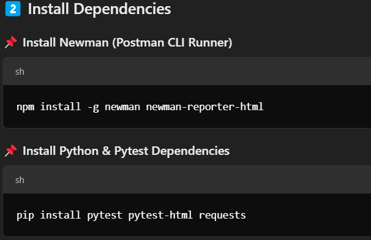
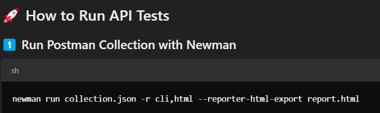
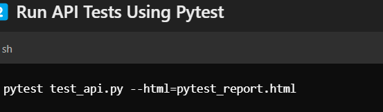
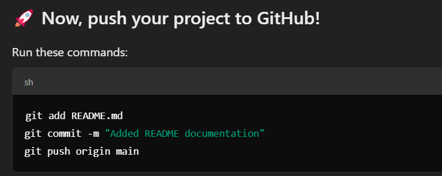

🚀 𝐀𝐮𝐭𝐨𝐦𝐚𝐭𝐞𝐝 𝐀𝐏𝐈 𝐓𝐞𝐬𝐭𝐢𝐧𝐠 𝐅𝐫𝐚𝐦𝐞𝐰𝐨𝐫𝐤
📌 𝙋𝙧𝙤𝙟𝙚𝙘𝙩 𝙊𝙫𝙚𝙧𝙫𝙞𝙚𝙬
𝘛𝘩𝘪𝘴 𝘱𝘳𝘰𝘫𝘦𝘤𝘵 𝘪𝘴 𝘢𝘯 𝘈𝘶𝘵𝘰𝘮𝘢𝘵𝘦𝘥 𝘈𝘗𝘐 𝘛𝘦𝘴𝘵𝘪𝘯𝘨 𝘍𝘳𝘢𝘮𝘦𝘸𝘰𝘳𝘬 𝘣𝘶𝘪𝘭𝘵 𝘶𝘴𝘪𝘯𝘨 𝘗𝘰𝘴𝘵𝘮𝘢𝘯, 𝘕𝘦𝘸𝘮𝘢𝘯, 𝘗𝘺𝘵𝘦𝘴𝘵, 𝘢𝘯𝘥 𝘋𝘰𝘤𝘬𝘦𝘳. 𝘐𝘵 𝘦𝘯𝘢𝘣𝘭𝘦𝘴 𝘦𝘧𝘧𝘪𝘤𝘪𝘦𝘯𝘵 𝘮𝘢𝘯𝘶𝘢𝘭 & 𝘢𝘶𝘵𝘰𝘮𝘢𝘵𝘦𝘥 𝘈𝘗𝘐 𝘵𝘦𝘴𝘵𝘪𝘯𝘨, 𝘨𝘦𝘯𝘦𝘳𝘢𝘵𝘦𝘴 𝘳𝘦𝘱𝘰𝘳𝘵𝘴 📊, 𝘢𝘯𝘥 𝘪𝘯𝘵𝘦𝘨𝘳𝘢𝘵𝘦𝘴 𝘸𝘪𝘵𝘩 𝘊𝘐/𝘊𝘋 𝘱𝘪𝘱𝘦𝘭𝘪𝘯𝘦𝘴.

🛠 𝙏𝙚𝙘𝙝 𝙎𝙩𝙖𝙘𝙠 & 𝙏𝙤𝙤𝙡𝙨
Postman → API Request Testing
Newman → CLI Runner for Postman Collections
Pytest → API Test Automation
Docker → Containerized Execution
GitHub → Version Control

⚡ 𝙎𝙚𝙩𝙪𝙥 & 𝙄𝙣𝙨𝙩𝙖𝙡𝙡𝙖𝙩𝙞𝙤𝙣

📜 𝐏𝐫𝐨𝐣𝐞𝐜𝐭 𝐖𝐨𝐫𝐤𝐟𝐥𝐨𝐰
✅ Create API Collection in Postman & Export as JSON
✅ Run API Tests via Newman CLI
✅ Automate API Testing with Pytest
✅ Generate Reports for test results
✅ Integrate with CI/CD & Docker (Optional)

📊 𝙍𝙚𝙥𝙤𝙧𝙩𝙨 & 𝙇𝙤𝙜𝙨
Postman + Newman Reports → HTML format
Pytest Reports → report.html
Docker Logs (if using containers)
